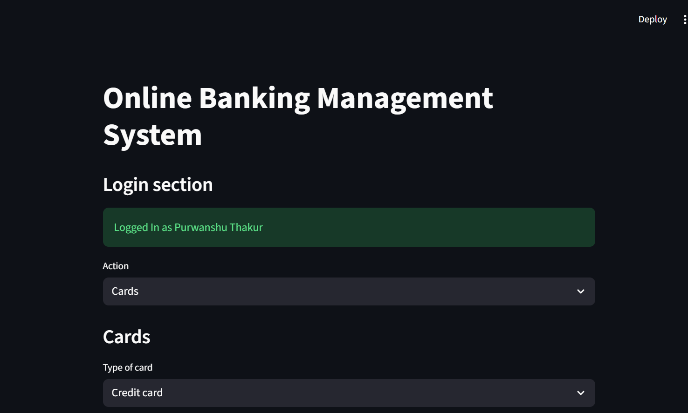

# Online Banking System

This project automates banking operations using Python, MySQL, and Streamlit, providing essential features such as account management, transaction history, credit card and loan applications, and more.

---

## Table of Contents

- [Introduction](#introduction)
- [Features](#features)
- [System Architecture](#system-architecture)
- [ER and Use Case Diagrams](#er-and-use-case-diagrams)
- [Technologies Used](#technologies-used)
- [Front-end](#front-end)

---

## Introduction

The Online Banking System aims to streamline banking processes, provide secure transactions, and offer a paperless banking experience. Developed using Python and MySQL, it includes features such as account management, fund transfers, credit/debit cards management, loan repayment and detailed transaction history.

### Objectives

- Automate banking transactions.
- Ensure efficient and secure record-keeping.
- Simplify banking processes with a user-friendly interface.
- Provide a paperless and eco-friendly banking experience.
- Showcase advanced MySQL operations and queries.

---

## Features

- **Account Management**: View account details, update account limits, and manage funds.
- **Transaction History**: Access detailed transaction records.
- **Credit/Debit Cards**: View and update card limits.
- **Loan Management**: Monitor and repay loans.
- **Transfer Funds**: Transfer Funds to other accounts.
---

## System Architecture

### Proposed Flow Diagram

### Frontend and Backend Overview

- **Frontend**: Built with Streamlit, offering an intuitive and interactive interface.
- **Backend**: Powered by MySQL for robust data management.

---

## Technologies Used

- **Python**: Core programming language.
- **Streamlit**: Frontend development.
- **MySQL**: Database management system.
- **MySQL Connector**: Python library for MySQL connectivity.

---

## Front-end

### Login Page

### Home Page

### Account Setting

### Cards Information and Settings

### Loan Information and Repayment

### Transaction History

---
